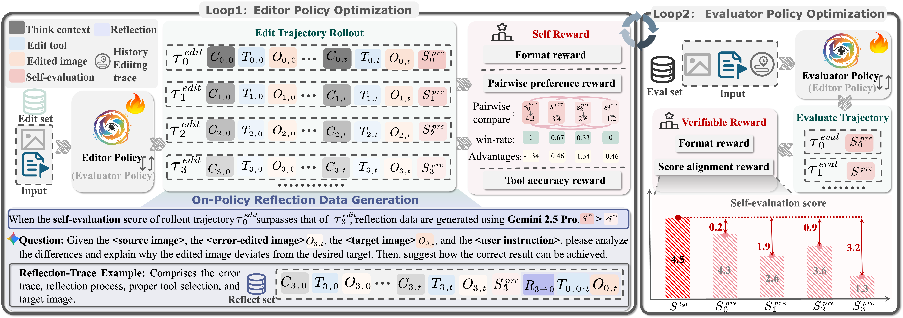
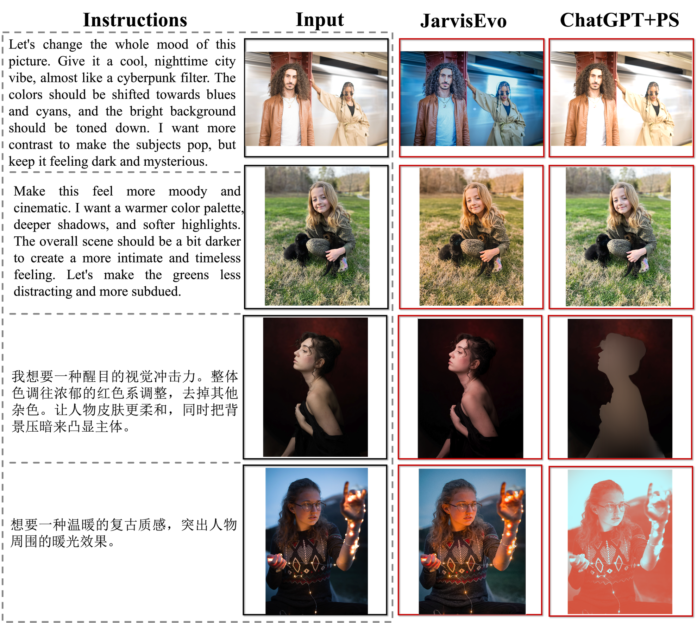
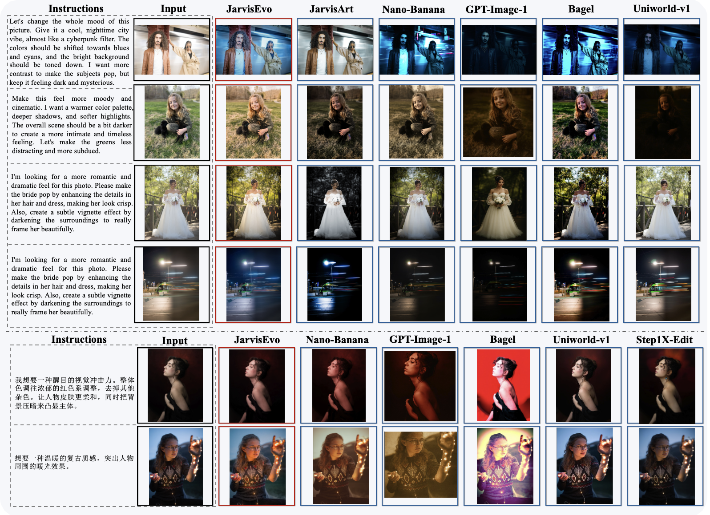

<div align="center">
  

# JarvisEvo: Towards a Self-Evolving Photo Editing Agent with Synergistic Editor-Evaluator Optimization
  <a href="https://arxiv.org/pdf/2511.23002"></a>
  <a href="https://jarvisevo.vercel.app/"></a>
  <a href="https://huggingface.co/JarvisEvo/JarvisEvo"></a>
  <a href="https://huggingface.co/datasets/JarvisEvo/ArtEdit-Bench/tree/main"></a>
  <a href="https://mp.weixin.qq.com/s/oGhkzO7ZWB7vQab-mLPrAw"></a>
  <a href="https://mp.weixin.qq.com/s/DLwJqbiBmC5rrNscgHC-9Q"></a>
  </div>

<div align="center">
  <p>
    <a href="https://lyl1015.github.io/">Yunlong Lin<sup>*</sup></a>, 
    <a href="https://scholar.google.com/citations?hl=en&view_op=list_works&gmla=AH8HC4z9rmDHYjp5o28xKk8U4ddD_n7BuMnk8UZFP-jygFBtHUSz6pf-5FP32B_yKMpRU9VpDY3iT8eM0zORHA&user=Hy12lcEAAAAJ">
    Linqing Wang<sup>*</sup></a>, 
    <a href="https://github.com/kunjie-lin">Kunjie Lin<sup>*</sup></a>, 
    <a href="https://github.com/iendi">Zixu Lin<sup>*</sup></a>, 
    <a href="https://kxgong.github.io"> Kaixiong Gong, 
    <a href="https://fenglinglwb.github.io/">Wenbo Li</a>, 
    <a href="https://linb203.github.io/">Bin Lin</a>, 
    Zhenxi Li, 
    <a href="https://shiyi-zh0408.github.io/">Shiyi Zhang</a>, 
    <a href="https://github.com/1230young">Yuyang Peng</a>, 
    <a href="https://github.com/Dai-Wenxun">Wenxun Dai</a>, 
    <a href="https://scholar.google.com/citations?user=k5hVBfMAAAAJ&hl=zh-CN">Xinghao Ding<sup>3♣</sup></a>, 
    <a href="https://scholar.google.com/citations?user=VXQV5xwAAAAJ&hl=en">Chunyu Wang†</a>, 
    <a href="https://openreview.net/profile?id=~Qinglin_Lu2">Qinglin Lu†</a>
  </p>
</div>

<div align="center">
  <p>
    Tencent Hunyuan, Xiamen University
  </p>
  <sup>*</sup>Equal Contributions <sup>†</sup>Project Leader <sup>♣</sup>Corresponding Author
</div>


<details open><summary>💡 We also have other image editing agents that may interest you ✨. </summary><p>
<!--  may -->

> [**[NeurIPS' 2025] JarvisArt: Liberating Human Artistic Creativity via an Intelligent Photo Retouching Agent**](https://arxiv.org/pdf/2506.17612) <br>
> Yunlong Lin, Zixu Lin and Kunjie Lin, etc. <br>
[](https://github.com/LYL1015/JarvisArt)  [](https://github.com/LYL1015/JarvisArt) [](https://arxiv.org/pdf/2506.17612) [](https://jarvisart.vercel.app/) [](https://huggingface.co/spaces/LYL1015/JarvisArt-Preview) <br>
> </p></details>

## 📮 News
- **[2026.02.21]** 🎉 JarvisEvo has been accepted by CVPR 2026!
- **[2025.12.29]** We are grateful for the coverage by 机器之心 ([link](https://mp.weixin.qq.com/s/oGhkzO7ZWB7vQab-mLPrAw)) and 量子位 ([link](https://mp.weixin.qq.com/s/DLwJqbiBmC5rrNscgHC-9Q)). Thank you for the support!
- **[2025.12.16]** JarvisEvo's project page, paper are now available!

## 📦 Model Weights and Datasets

| Resource | Type | Size | Download Link | Description |
|----------|------|------|---------------|-------------|
| **JarvisEvo-8B** | Model Weights | ~17GB | [🤗 Hugging Face](https://huggingface.co/JarvisEvo/JarvisEvo) | Main model checkpoint for JarvisEvo |
| **ArtEdit-Bench** | Dataset | ~1GB | [🤗 Hugging Face](https://huggingface.co/datasets/JarvisEvo/ArtEdit-Bench) | Evaluation benchmark dataset |

**Quick Download Commands:**
```bash
# Download model weights
huggingface-cli download JarvisEvo/JarvisEvo --local-dir ./checkpoints/pretrained/JarvisEvo

# Download datasets
huggingface-cli download JarvisEvo/ArtEdit-Bench --repo-type dataset --local-dir ./datasets/ArtEdit-Bench
```

## 🎪 Open-source Plan

- [x] Create repo and project page
- [x] Release Inference code and checkpoints
- [x] Release Agent-to-Lightroom Protocol (server-client communication protocol for multi-machine, multi-GPU training with distributed Lightroom instances)
- [x] Release ArtEdit-Bench
- [x] Release SFT training code
- [ ] Release SEPO, RFT training code


## 🧭 Table of Contents

- [📮 News](#-news)
- [🎪 Open-source Plan](#-open-source-plan)
- [🧭 Overview](#-overview)
  - [📝 Key Features](#-key-features)
  - [📊 Visual Comparison](#-visual-comparison)
- [💻 Getting Started](#-getting-started)
  - [Batch Inference](./docs/README_Inference.md)
  - [Training Guide](./docs/README_training.md)
  - [Evaluation](./docs/README_Evaluation.md)
  - [Agent-to-Lightroom Protocol](./lrc_scripts/clients/agent_to_lightroom/README.md)
- [🙏 Acknowledgements](#-acknowledgements)
- [🌤️ Discussion Group](#️-discussion-group)
- [📧 Contact](#-contact)
- [📚 Citation](#-citation)
- [📜 License](#-license)


## 🧭 Overview
<div align="center">
  
  <br>
  <!-- <em>JarvisEvo workflow and results showcase</em> -->
</div>
JarvisEvo performs interleaved multimodal Chain-of-Thought (iMCoT) reasoning for image editing, which marries multi-step
planning, dynamic tool orchestration, and iterative visual feedback. This closed-loop workflow incorporates self-evaluation and refinement to ensure the final output is both visually compelling and faithful to the creative vision. By seamlessly integrating professional tools like Adobe Lightroom for precision adjustments and Qwen-Image-Edit for generative tasks, the system achieves a unique synergy of expert-
level refinement and creative synthesis.


## 📝 Key Features
<div align="center">
  
  <br>
  <!-- <em>JarvisEvo workflow and results showcase</em> -->
</div>

### 🧠 Interleaved Multimodal Chain-of-Thought (iMCoT)
**Closed-Loop Reasoning:** "Thinks" with both text and images, validating steps against visual feedback to minimize hallucinations and error propagation.

### 🔄 Synergistic Editor-Evaluator Optimization (SEPO)
**Self-Evolving Framework:** A dual-loop reinforcement learning system where the model acts as both editor and evaluator, refining strategies via intrinsic rewards without relying on static external models.

### 🎨 Unified Preservative & Generative Editing
**Comprehensive Toolset:** Seamlessly integrates **Adobe Lightroom** (200+ tools) for precise adjustments and **Qwen-Image-Edit** for creative synthesis (object removal, style transfer), handling the full spectrum of editing tasks.

### 🪞 Self-Reflective Learning Mechanism
**Autonomous Improvement:** Automatically generates reflection trajectories upon suboptimal results, enabling the model to learn from mistakes and continuously optimize its tool selection logic.


## 📊 Visual Comparison

<div align="center">
  
  <br>
  <em>Comparison with ChatGPT x Adobe Photoshop</em>
</div>

<div align="center">
  
  <br>
  <em>Comparison with Leading Image Editing Models</em>
</div>


<!-- | Instruction | Input | JarvisEvo | ChatGPT+PS |
|-------------|-------|-----------|------------|
| Enhance the portrait with professional retouching |  |  |  |
| Remove unwanted objects and adjust lighting |  |  |  |
| Apply cinematic color grading and style transfer |  |  |  | -->

 ## 💻 Getting Started

For batch inference, please follow:
- [Batch Inference](docs/README_Inference.md) 

For training, please follow:
- [Training Guide](docs/README_training.md)

For evaluation, please follow:
- [Evaluation](./docs/README_evaluation.md)

For Agent-to-Lightroom Protocol Detail, please follow:
- [Agent-to-Lightroom Protocol](./lrc_scripts/clients/agent_to_lightroom/README.md)


## 🙏 Acknowledgements

We would like to express our gratitude to [LLaMA-Factory](https://github.com/hiyouga/LLaMA-Factory.git) for their valuable open-source contributions which have provided important technical references for our work.

## 🌤️ Discussion Group

If you have any questions during the trial, running or deployment, feel free to join our WeChat group discussion! 

<div align="center">
  <table>
    <tr>
      <td align="center">
        
        <p>WeChat Group 1</p>
      </td>
      <td align="center">
        
        <p>WeChat Group 2</p>
      </td>
    </tr>
  </table>
  <p>Scan QR code to join WeChat group discussion</p>
</div>


## 📧 Contact

For any questions or inquiries, please reach out to us:

- **Yunlong Lin**: linyl@stu.xmu.edu.cn

---

## 📚 Citation

If you find JarvisEvo useful in your research, please consider citing:

```bibtex
@article{lin2025jarvisevo,
  title={JarvisEvo: Towards a Self-Evolving Photo Editing Agent with Synergistic Editor-Evaluator Optimization},
  author={Lin, Yunlong and Wang, Linqing and Lin, Kunjie and Lin, Zixu and Gong, Kaixiong and Li, Wenbo and Lin, Bin and Li, Zhenxi and Zhang, Shiyi and Peng, Yuyang and others},
  journal={arXiv preprint arXiv:2511.23002},
  year={2025}
}
```

---

## 📜 License
The **JarvisEvo** model weights, inference code, and associated materials are made freely available by Yunlong Lin for academic research, personal study, and other non-commercial uses under the **JarvisEvo Non-Commercial License**.

By downloading, accessing, or using the JarvisEvo model, you agree to the terms of this license. Please refer to the [`JarvisEvo Non-Commercial License v1.0`](LICENSE) file in this repository for the full terms and conditions.

**Commercial Use:** If you wish to use the JarvisEvo model or its derivatives for commercial purposes, please contact me at [linyl@stu.xmu.edu.cn] to request a commercial license.
